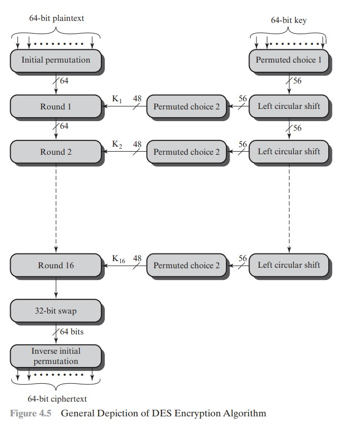

# Cifras Simétricas

# Capítulo 4 - DES - Data Encryption Standard

O DES foi o principal esquema de criptografia utilizado desde 1977 até a introdução do AES em 2001.
Hoje encontra-se obsoleto.

A figura a seguir representa o esquema de criptografia DES.



Exemplo utilizando o esquema de criptografia DES.
```sh
openssl rand -hex 64 > message-des.txt; 
openssl rand -hex 16 > message-des.key;
openssl des -e -in ./message-des.txt -k ./message-des.key -out ./message-des.enc

```

Visualizando o conteúdo da mensagem criptografada
```sh
hexdup ./message-des.enc
```