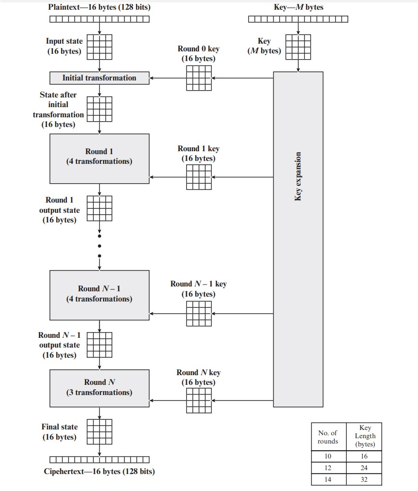

# Cifras Simétricas

# Capítulo 6 - AES - Advanced Encryption Standard

O esquema de criptografia de bloco simétrico AES - Advanced Encryption Standard, foi publicado pelo NIST em 2001 em substituição ao DES.

O AES também é conhecido como Cifra Rijndael.

Confira no link a seguir o funcionamento do AES.

[Rijndael Encryptor](https://formaestudio.com/rijndaelinspector/archivos/Rijndael_Animation_v4_eng-html5.html)

[Vídeo](https://www.youtube.com/watch?v=mlzxpkdXP58&list=PLzrY8E1mqq-msOzaf-bgw9e-E69QiIu7W&index=5)

A figura a seguir mostra o processo criptografia AES

