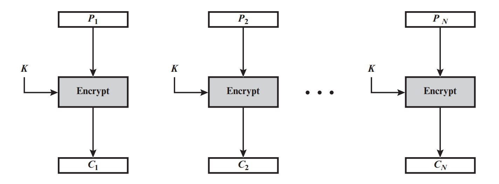

# Cifras Simétricas

# Capítulo 7 - Modos de Operação de Cifras de Bloco

Enquanto o DES e AES descrevem o esquema de critografia, o modo como a criptografia é realizada dependerá do modo de operação adorato. 
Os principais modos de operação são:

### [ECB – Eletronic CodeBook](#71---ecb--eletronic-codebook)
### CBC – Cipher Block Chaining
### CFB – Cipher Feedback
### OFB – Output Feedback
### CTR - Counter

## 7.1 - ECB – Eletronic CodeBook

O modo ECB (electronic code book) é o modo onde o algoritmo de criptografia é utilizado puramente, como ele foi definido.


A figura a seguir ilustra o modo de operação do ECB - Eletronic CodeBook



#### Exemplo de criptografia utilizando o algorítimo AES com o modo de operação ECB.

Por possuir baixa entropia, o modo de operação ECB não é mais seguro.
O exemplo a seguir mostra a comparação da imagem original e a critografada.

```sh
#Criar uma chave cifrar as imagens
openssl rand -hex 16 > figura.bmp.key
#4bb108fab488702e0279b4c2a70d8179
```

Cifrar a imagem figura.bmp com o algoritmo AES-128 no modo ECB
```sh
openssl aes-128-ecb -in ./figura.bmp -out ./figura.ecb.bmp.enc -k  ./figura.bmp.key -iv=0
```

Como os arquivos gerados tiveram o seus cabeçalhos alterados na cifragem, basta usar o programa bmphc para refazer os cabeçalhos, de modo a permitir a visualização das imagens.

```sh
cp figura.ecb.bmp.enc ./figura.ecb.bmp  ;
```

```sh
./bmphc figura.bmp figura.ecb.bmp
```

Comparação da figura original com a criptografada

 