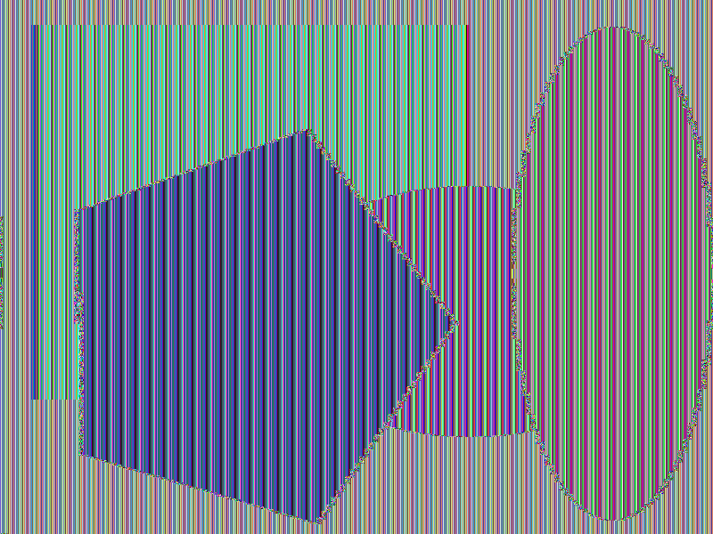

# Cifras Simétricas

# Capítulo 7 - Modos de Operação de Cifras de Bloco

Enquanto o DES e AES descrevem o esquema de critografia, o modo como a criptografia é realizada dependerá do modo de operação adorato. 
Os principais modos de operação são:

### [ECB – Eletronic CodeBook](#71---ecb--eletronic-codebook)
### [CBC – Cipher Block Chaining](#72---cbc---cipher-block-chaining-mode)
### [CFB – Cipher Feedback](#73---cfb---cipher-feedback-mode)
### [OFB – Output Feedback](#74---ofm---output-feedback-mode)
### [CTR - Counter](#75---counter-mode)
### [XTS-AES ](#76---xts-aes)

## 7.1 - ECB – Eletronic CodeBook

O modo ECB (electronic code book) é o modo onde o algoritmo de criptografia é utilizado puramente, como ele foi definido.


A figura a seguir ilustra o modo de operação do ECB - Eletronic CodeBook


#### Exemplo de criptografia utilizando o algorítimo AES com o modo de operação ECB.

Por possuir baixa entropia, o modo de operação ECB não é mais seguro.
O exemplo a seguir mostra a comparação da imagem original e a critografada.

```sh
#Criar uma chave cifrar as imagens
openssl rand -hex 16 > figura.bmp.key
#4bb108fab488702e0279b4c2a70d8179
```

Cifrar a imagem figura.bmp com o algoritmo AES-128 no modo ECB
```sh
openssl aes-128-ecb -in ./figura.bmp -out ./figura.ecb.bmp.enc -k  ./figura.bmp.key -iv=0
```

Decifrar a imagem figura.ecb.bmp.enc com o algoritmo AES-128 no modo ECB
```sh
openssl aes-128-ecb -d -k ./figura.bmp.key -iv=0 -in ./figura.ecb.bmp.enc -out ./figura.ecb.dec.bmp
```

Como os arquivos gerados tiveram o seus cabeçalhos alterados na cifragem, basta usar o programa bmphc para refazer os cabeçalhos, de modo a permitir a visualização das imagens.

```sh
cp figura.ecb.bmp.enc ./figura.ecb.bmp  ;
```

```sh
./bmphc figura.bmp figura.ecb.bmp
```

Comparação da figura original com a criptografada

 


## 7.2 - CBC - Cipher Block Chaining Mode

No modo CBC (cipher block chaining), o texto em claro é dividido em blocos, porém antes do algoritmo de criptografia processar o bloco, o bloco sofre uma adição com  os bits do bloco anterior.

A figura a seguir ilustra o modo de operação do CBC - Cipher Block Chaining Mode


Cifrar a imagem figura.bmp com o algoritmo AES-128 no modo CBC
```sh
openssl aes-128-cbc -in ./figura.bmp -out ./figura.cbc.bmp.enc -k  ./figura.bmp.key -iv=0
```

Decifrar a imagem figura.ecb.bmp.enc com o algoritmo AES-128 no modo CBC
```sh
openssl aes-128-cbc -d -k ./figura.bmp.key -iv=0 -in ./figura.cbc.bmp.enc -out ./figura.cbc.dec.bmp
```

As figuras a seguir mostram a comprarção entre a imagem original e a cirptografada com o algoritmo AES no modo CBC
 


# Outros modos de operação
## 7.3 - CFB - Cipher Feedback Mode

Cifrar a imagem figura.bmp com o algoritmo AES-256 no modo CFB
```sh
openssl aes-256-cfb -in ./figura.bmp -out ./figura.cfb.bmp.enc -k ./figura.bmp.key -iv=0
```

Decifrar a imagem figura.cfb.bmp.enc com o algoritmo AES-256 no modo CFB
```sh
openssl aes-256-cfb  -d -k ./figura.bmp.key -iv=0 -in ./figura.cfb.bmp.enc -out ./figura.cfb.dec.bmp
```

## 7.4 - OFM - Output Feedback Mode

Cifrar a imagem figura.bmp com o algoritmo AES-256 no modo OFB
```sh
openssl aes-256-ofb -in ./figura.bmp -out ./figura.ofb.bmp.enc -k ./figura.bmp.key
```

Decifrar a imagem figura.ofb.bmp.enc com o algoritmo AES-256 no modo OFB
```sh
openssl aes-256-ofb  -d -k ./figura.bmp.key -in ./figura.ofb.bmp.enc -out ./figura.ofb.dec.bmp
```

## 7.5 - Counter Mode

Cifrar a imagem figura.bmp com o algoritmo AES-256 no modo CTR
```sh
openssl aes-256-ctr -in ./figura.bmp -out ./figura.ctr.bmp.enc -k ./figura.bmp.key
```

Decifrar a imagem figura.ctr.bmp.enc com o algoritmo AES-256 no modo CTR
```sh
openssl aes-256-ctr  -d -k ./figura.bmp.key -in ./figura.ctr.bmp.enc -out ./figura.ctr.dec.bmp
```

## 7.6 - XTS-AES 

Cifrar a imagem figura.bmp com o algoritmo AES-256 no modo CTR
```sh
openssl aes-256-ctr -in ./figura.bmp -out ./figura.ctr.bmp.enc -k ./figura.bmp.key
```

Decifrar a imagem figura.ctr.bmp.enc com o algoritmo AES-256 no modo CTR
```sh
openssl aes-256-ctr  -d -k ./figura.bmp.key -in ./figura.ctr.bmp.enc -out ./figura.ctr.dec.bmp
```