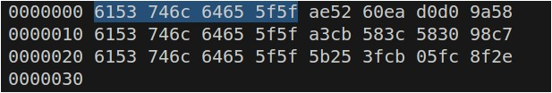

# Cifras Simétricas

# Capítulo 8 - Geradores de Bit Aleatório e Cifras de Fluxo (Random Bit Generation and Stream Ciphers)

As cifras de fluxo criptografam o texto um byte de cada vez ou um bit de cada vez.

A cifra de fluxo mais famosa é a RC4.
Esta nunca deve ser usada para cifrar textos diferentes com a mesma chave.

Observe o resultado dos 3 textos diferentes cifrados com a mesma chave

Criando os textos para serem cifrados
```sh
echo "1111111111111111" > 1.txt
echo "22222222222222" > 2.txt
echo "3333333333333333" > 3.txt
echo "4bb108fab488702e0279b4c2a70d8179" > key.txt
```
Cifrando mensagem com o CR4
```sh 
openssl enc -rc4-40 -in 1.txt -out 1.enc -k key.txt
openssl enc -rc4-40 -in 2.txt -out 2.enc -k key.txt
openssl enc -rc4-40 -in 3.txt -out 3.enc -k key.txt
```

Visualizando o conteúdo do arquivo criptografado
```sh
hexdump 1.enc 2.enc 3.enc 
```

Como pode ser conferido na imagem a seguir, o 8 primeiros bytes de cada arquivo possuem o mesmo cabeçalho, devido a chave serer a mesma utilizada para criptografar os arquivos 1.txt, 2.txt e 3.txt

