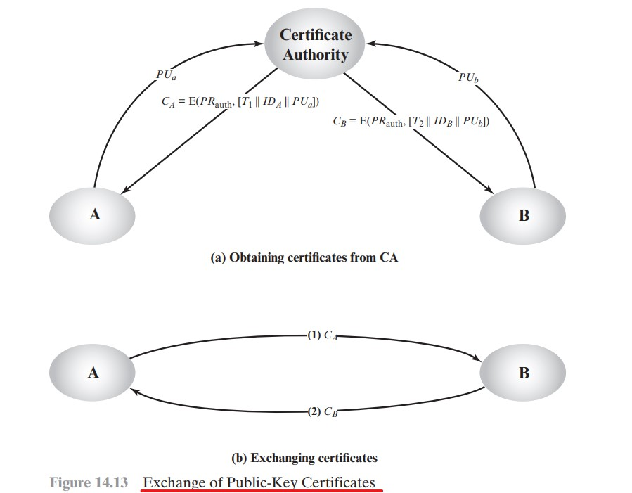

# Cifras Assimétricas

# Cap 14 - Emissão de Certificado Digital com RSA

A finalidade de um Certificado Digital é atestar a autenticidade de uma chave pública pertentente a uma entidade.

Para validar se uma chave pública é origial (autêntica), ela é colocada dentro de um Certificado Digital, o qual é assinado por uma terceira parte confiável. 

No Brasil, esta terceira parte é a Infraestrutura de Chaves Públicas Brasileira – ICP-Brasil.
Sua estrutura detalhada poderá ser verificada em: [Estrutura ITI](https://estrutura.iti.gov.br/)

Para exemplificação, o certificado do ICP-Brasíl está anexado no projeto [ICP-Brasilv11.crt](./ICP-Brasilv11.crt)


## Distribuição de Chaves Públicas RSA

Conforme pode ser visualizado na imagem a seguir, para realizar a troca de chaves públicas de maneira segura, é necessário que as duas partes A e B primeiramente solicitem à Autoridade Certificadora (ICP Brasil, por exemplo) a emissão de um certificados atestanto a autenticidades de suas chaves públicas. 

Com o certificado em mãos, as partes A e B podem enviar os certificados um ao outro, de modo que cada um consiga validar a autenticidade da chave pública antes de iniciar o envio de mensagens para a outra parte.




# Passo a Passo para Emissão de Certificado Digital para uma Entidade.

No exemplo a seguir, iremos simular o papel exercido pelo ICP. Neste exemplo será criado a Autoridade Certificadora (ICP), que por sua vez será utilizada para emitir o Certificado da Chave Pública do Cliente A. Para o cliente B o processo de emissão do certificado é idêntido, por isso não será demostrado.

## Passo 1: Emissão das Chaves Públicas e Privadas do Cliente A.

Similarmente como o descrito nos exemplos do  Cap 9, será criado uma par de chaves RSA para o cliente A. Lembrando que o Certificado é emitido apenas para a Chave Pública de A, a chave privada, sempre, deverá ser mantida em segredo.

```sh
openssl genpkey -algorithm RSA -pkeyopt rsa_keygen_bits:4096 -out chave-privada-do-cliente-A.key
openssl rsa -in chave-privada-do-cliente-A.key -pubout > chave-publica-do-cliente-A.key
# (Opcional) Visualização da chave privada emitida.
#openssl rsa -text -noout -in chave-privada-do-cliente-A.key 
```

## Passo 2: Criar a Autoridade Certificadora (Certification Authority) para Imissão de Certificados.

Neste exemmplo, a Autoridade Certificadora simulará a função da AC raiz Brasileira (ICP-Brasil)

### Passo 2.1: Criar a Chave privada com Senha para a Autoridade Certificadora

Essa chave poderá ser gerada a senha, para issso, bata omitir o altorírimo de criptografia (-aes256)
```sh
openssl genrsa -aes256 -out CA-chave-privada.key 4096 #password: senha@123
#(Opcional) Emissão da chave pública
# openssl rsa -in CA-chave-privada.key -pubout > CA-chave-publica.key
```
### Passo 2.1: Gerar o Certificado para a Autoridade Certificadora Raiz (Root CA)
Para que a Autoridade certificadora possa emitir certificados

```sh
openssl req -x509 -new -nodes -key CA-chave-privada.key -sha256 -days  1826 -out CA-certificado.crt -subj '/C=BR/O=ICP-Brasil/OU=Instituto Nacional de Tecnologia da Informacao - ITI/CN=Autoridade Certificadora Raiz Brasileira v11' #password: senha@123
```


