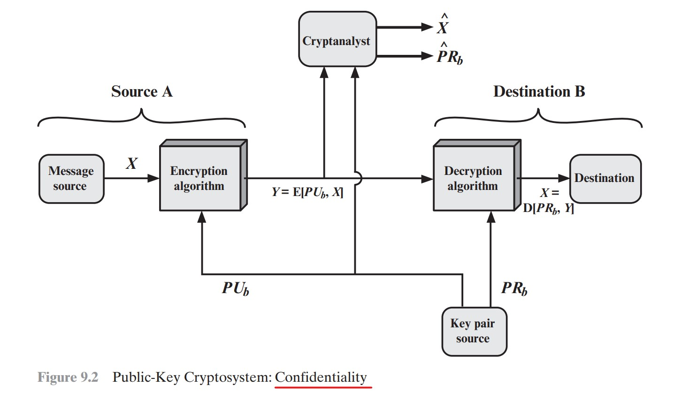

# Cifras Assimétricas

# Cap 9 - Criptografia de Chave Pública com RSA (Rivest-Shamir-Adleman)

Com a criptografia assimétrica é possível prover, de maneira revolucionária, tanto a confidencialidade quanto a autenticidade. Estes dois atributos podem ser providos de maneira individual ou juntos.

Outro assunto indispensável para se trabalhar com criptografia assimétrica é a criação de certificados digitais.

A seguir, serão abordadas, de maneira prática, a garantia da confidencialidade, autencidade e a criação de certificados digitais.

## Cap 9.1 - Provendo Confidencialidade com RSA

Por meio da criptografia de chave pública com  RSA é possível garantir que somente pessoas autorizadas possam ter acesso à mensagem criptografada.

Para prover esse mecanismo, conforme ilustrado na figura a seguir, os seguites passos devem ser observados.

1 - O remetente (Source A) pega a chave pública do Destinatário (Destination B) e com ela criptografa a mensagem;

2 - A mensagem criptografada poderá ser enviada por um canal não criptografado; e

3 - O destinatário recebe a mensagem, e a recupera com base na sua chave privada. Pois somente o portador da chave privada será capaz de decriptografar a mensagem.



## Passo a passo para simular o envio e recebimento de mensagem criptografada com RSA com garantia da confidencialidade

Antes de começarmos, vale apena verificar todos os algorítimos de chaves públicas disponíveis por meio do OpenSSL.

```sh
openssl list -public-key-algorithms
man openssl-genpkey
```
Enfim agora vamos ao que interessa, vamos criptografar uma mensagem com a cifra assimétrica RSA com uma chave de  4096 bits, e recuperá-la com a chave pública do destinatário.

## Passo 1: Criar uma chave privada para o destinatário (Essa é a única chave que consegue recuperar a mensagem).

```sh
openssl genpkey -algorithm RSA -pkeyopt rsa_keygen_bits:4096 -out chave-privada-do-destinatario.key
```

Antes de continuarmos, vale apena observar alguns detalhes da chave privada. Os comandos a seguir poderão ser aplicados para visualizar os detalhes da chave privada do destinatário recém criada.

```sh
openssl rsa -text -noout -in chave-privada-do-destinatario.key
```
ou 
```sh
cat chave-privada-do-destinatario.key
```

## Passo 2: Exportação da Chave pública a partir da Chave privada
Como a chave pública deve ser mantida em segredo pelo destinatário, é necessário criar uma chave pública para ser compartilhada com todos que queiram enviar mensagem ao destinatário de forma segura.

```sh
openssl rsa -in chave-privada-do-destinatario.key -pubout > chave-publica-do-destinatario.key
```

## Passo 3: Cifrar uma mensagem com a Chave Pública RSA
Com a chave pública em mãos, o remetente poderá escrever mensagens secretas, de forma segura, ao destinatário.

```sh
openssl pkeyutl -encrypt -pubin  -in mensagem_secreta.txt -inkey chave-publica-do-destinatario.key -out mensagem_criptografada_com_RSA.enc

```

## Passo 4: Decriptografar a mensagem com a Chave Privada RSA
Tomando base que a mensagem foi recebida pelo destinatário, este poderá decriptografá-la por meio da utilização da chave privada.

```sh
openssl pkeyutl  -decrypt -in mensagem_criptografada_com_RSA.enc -out mensagem_decriptografada_com_RSA.txt -inkey chave-privada-do-destinatario.key
```

## Observações: 
A criptografia RSA não pode ser utilizada para proteger mensagens ou arquivos cujo tamanho é maior que o tamanho do módulo utilizado pelo RSA.

Exemplo: cifrando o arquivo Brackobama com a chave privada de 4096 bits.
```sh
openssl pkeyutl -encrypt -pubin  -in BarackObama.pdf -inkey chave-publica-do-destinatario.key -out BarackObama.enc
```
O seguinte erro ocorrerá devido o arquivo BarackObama.pdf ser maior que o módulo da chave privada RSA: 

```sh
Public Key operation error
40B71E067B7F0000:error:0200006E:rsa routines:ossl_rsa_padding_add_PKCS1_type_2_ex:data too large for key size:../crypto/rsa/rsa_pk1.c:129:
```