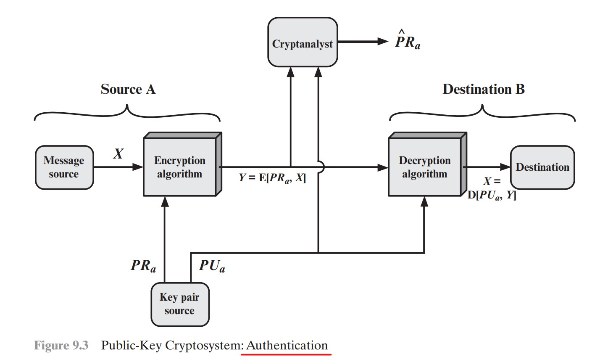

# Cifras Assimétricas

# Cap 9 - Criptografia de Chave Pública com RSA (Rivest-Shamir-Adleman)

Com a criptografia assimétrica é possível prover, de maneira revolucionária, tanto a confidencialidade quanto a autenticidade. Estes dois atributos podem ser providos de maneira individual ou juntos.

Outro assunto indispensável para se trabalhar com criptografia assimétrica é a criação de certificados digitais.

A seguir, serão abordadas, de maneira prática, a garantia da confidencialidade, autencidade e a criação de certificados digitais.

## Cap 9.1 - Provendo Autenticidade com RSA  - (Assinatura Digital)

Além da confidencialidade de uma mensagem, o mecanismo criptográfico de Cifras Assimétricas RSA, possibilita a assinatura digital, de forma prover a autenticidade de uma mensagem. Certificando assim que a mensagem realmente foi originada pelo remetente (quem envia).

Conforme o exemplo da imagem a seguir, o remetente utiliza sua Chave Privada para realizar a assinatura da mensagem. Após a assinatura, a mensagem é enviada ao destinatário. Em posse da mensagem, o destinatário poderá utilizar a chave pública do rementente para realizar a sua validação. 

Todo esse processo provê a autenticidade (Assinatura digital) da mensagem.



## Passo a Passo para Simular o processo de assinatura digital.

Nesse exemplo iremos assinar um documento com a crifra assimétrica RSA, e depois validar a assinatura no destinatário.


## Passo 1: Criar uma chave privada para o destinatário (Essa é a única chave que consegue recuperar a mensagem).

```sh
openssl genpkey -algorithm RSA -pkeyopt rsa_keygen_bits:16384 -out chave-privada-do-remetente.key
```

Antes de continuarmos, vale apena observar alguns detalhes da chave privada. Os comandos a seguir poderão ser aplicados para visualizar os detalhes da chave privada do destinatário recém criada.

```sh
openssl rsa -text -noout -in chave-privada-do-remetente.key
```
ou 
```sh
cat chave-privada-do-remetente.key
```

## Passo 2: Exportação da Chave pública a partir da Chave privada
Como a chave pública deve ser mantida em segredo pelo destinatário, é necessário criar uma chave pública para ser compartilhada com todos que queiram enviar mensagem ao destinatário de forma segura.

```sh
openssl rsa -in chave-privada-do-remetente.key -pubout > chave-publica-do-remetente.key
```

## Passo 3: Realizar a Assinatura Digital do Documento.

Para realizar a assinatura digital é utilizada a chave privada do remetente.

```sh
openssl pkeyutl -sign -inkey chave-privada-do-remetente.key -in documento-para-assinatura.txt -out documento-assinado-enc.txt
```

## Passo 4: Validar a Assinatura Digital do Documento

Para realizar a validação da assinatura digital utiliza-se a chave pública do remetente para recuperar o arquivo original e depois 
é realizada uma comparação entre o arquivo recuperado e o assinado, para validar a assinatura.
Caso a assinatura seja autêncica a saída do segundo comando a seguir será: "Signature Verified Successfully"

```sh
openssl rsautl -verify -pubin -pkcs -inkey chave-publica-do-remetente.key -in documento-assinado-enc.txt -out documento-validado.txt

openssl pkeyutl -verify -pubin -inkey chave-publica-do-remetente.key -in documento-validado.txt -sigfile documento-assinado-enc.txt 

```
