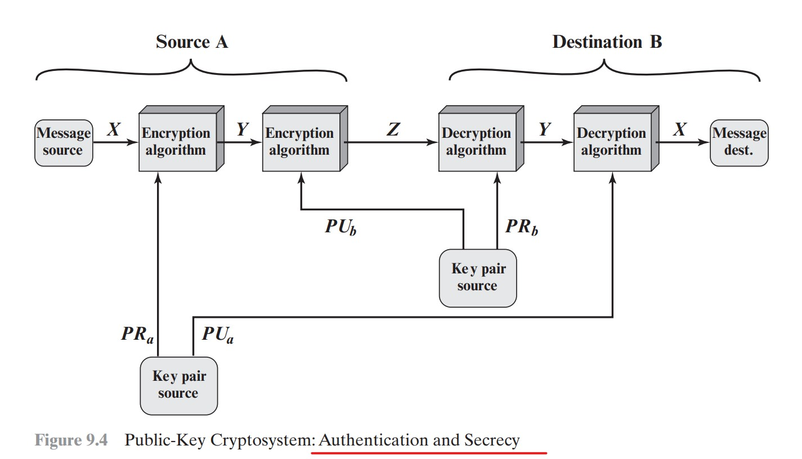

# Cifras Assimétricas

# Cap 9 - Criptografia de Chave Pública com RSA (Rivest-Shamir-Adleman)

Com a criptografia assimétrica é possível prover, de maneira revolucionária, tanto a confidencialidade quanto a autenticidade. Estes dois atributos podem ser providos de maneira individual ou juntos.

Outro assunto indispensável para se trabalhar com criptografia assimétrica é a criação de certificados digitais.

A seguir, serão abordadas, de maneira prática, a garantia da confidencialidade, autencidade e a criação de certificados digitais.

## Cap 9.1 - Provendo Confidencialidade e Autenticidade com RSA  - (Criptografia e sinatura Digital)

A confidencialidade e autenticidade de uma mensagem podem ser garantidas ao mesmo tempo, com a utilização do mecanismo de Cifras Assimétricas RSA. 

Como o exemplo da imagem a seguir, o remetente utiliza sua própria Chave Privada pra realizar a assinatura da mensagem, seguida de uma cripografia da mesma utilizando-se da Chave Pública do destinatário.




## Passo a Passo para simular o processo de criptografia e  assinatura digital  da mensagem.

Nesse exemplo, iremos assinar um documento com a crifra assimétrica RSA, criptografar o documento e despois enviar ao destinatário.


## Passo 1: Criar uma chave privada para o destinatário e outra para o remetente (a chave privada é a única capaz de recupera a mensagem criptografada ).

```sh
openssl genpkey -algorithm RSA -pkeyopt rsa_keygen_bits:4096 -out chave-privada-do-destinatario.key
openssl genpkey -algorithm RSA -pkeyopt rsa_keygen_bits:4096 -out chave-privada-do-remetente.key

```
Visualizando as chaves geradas: 
```sh
openssl rsa -text -noout -in chave-privada-do-destinatario.key
openssl rsa -text -noout -in chave-privada-do-remetente.key

```
ou 
```sh
cat chave-privada-do-destinatario.key
cat chave-privada-do-remetente.key
```

## Passo 2: Gerando a chave pública do Remetente e do Detinatário.

A chave chave-publica-do-destinatario.key será usada para criptografar a mensagem assinada, enquanto a chave chave-publica-do-remetente.key será utilizada para recuperar a mensagem assinada.

```sh
openssl rsa -in chave-privada-do-remetente.key -pubout > chave-publica-do-remetente.key
openssl rsa -in chave-privada-do-destinatario.key -pubout > chave-publica-do-destinatario.key
```

## Passo 3: 


```sh

```

## Passo 4: Valida a Assinatura Digital do Documento


```sh
openssl rsautl -verify -pubin -pkcs -inkey chave-publica-do-remetente.key -in documento-assinado-enc.txt -out documento-validado.txt

openssl pkeyutl -verify -pubin -inkey chave-publica-do-remetente.key -in documento-validado.txt -sigfile documento-assinado-enc.txt 

```
