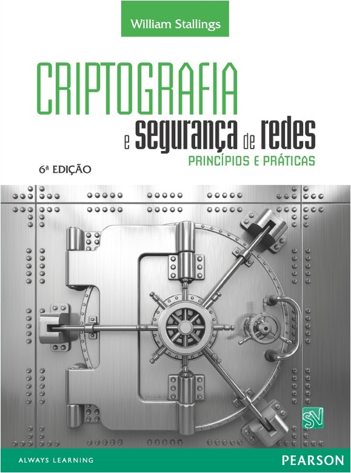
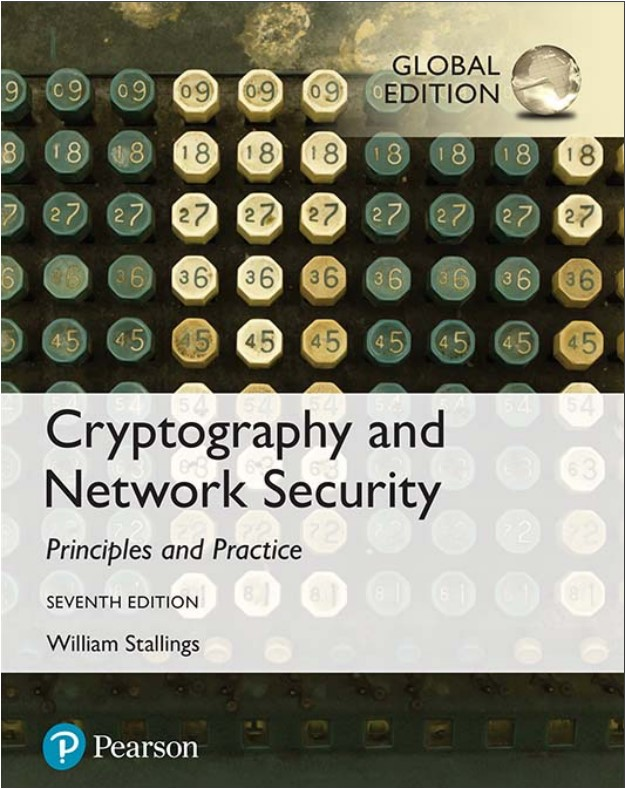

# How To Learn Cryptography in Practice

This tutorial help you learn about cryptography in Pratice.

## Este projeto é para quem deseja aprender sobre cryptografia de modo prático!

## Get Start!!!!

Este projeto está baseado no livro: [Criptografia e Segurança de Redes: princípios e práticas do autor  William Stallings](https://www.amazon.com.br/gp/product/B0167CVE0E/ref=dbs_a_def_rwt_hsch_vapi_tkin_p1_i1). Disponível para Download em: [link](https://www.cs.vsb.cz/ochodkova/courses/kpb/cryptography-and-network-security_-principles-and-practice-7th-global-edition.pdf)

 

## Confira a parte prática dos seguintes assuntos:

### [Captítulo 3 - Técnicas de Subistituição](./Cap_3/)

### [Capítulo 4 - Cifras de Bloco e DES - Data Encryption Standard](./Cap_4/)

### [Capítulo 6 - AES - Advanced Encryption Standard](./Cap_6/)

### [Capítulo 7 - Block Cipher Operation (ECB, EBC, CFB, OFM, Counter Mode e XTS-AES)](./Cap_7/)

### [Capítulo 8 - Geradores de Bit Aleatório e Cifras de Fluxo](./Cap_8/)

### [Capítulo 9 - Cifras Assimétricas](./Cap_9/)

### [Capítulo 11 - Funções Hash](./Cap_11/)